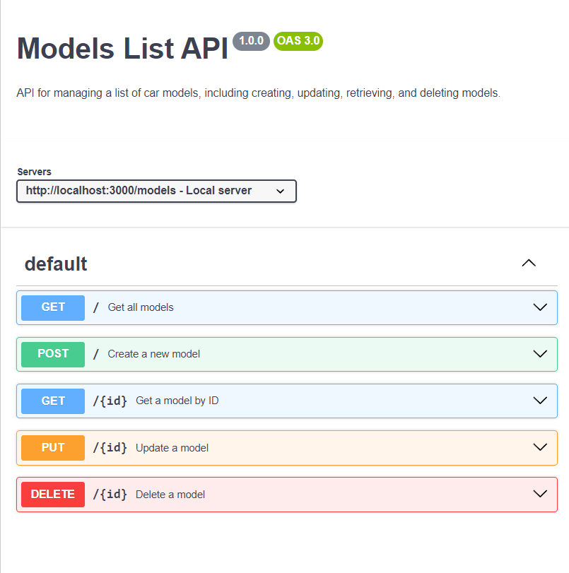

# FlaskAPI

# Models List API

## Overview
The Models List API is a simple RESTful service built using Flask. It allows users to manage a list of car models, including creating, updating, retrieving, and deleting models. Authentication is required to access the API.

## LocalHost 
Use thislocal host  
--localhost:3000/models
## Features
- Retrieve all car models
- Create a new car model
- Update an existing car model
- Delete a car model
- Get details of a specific car model by ID

## Prerequisites
- Python 3.8+
- Flask
- Flask-Blueprint
- Middleware for authentication